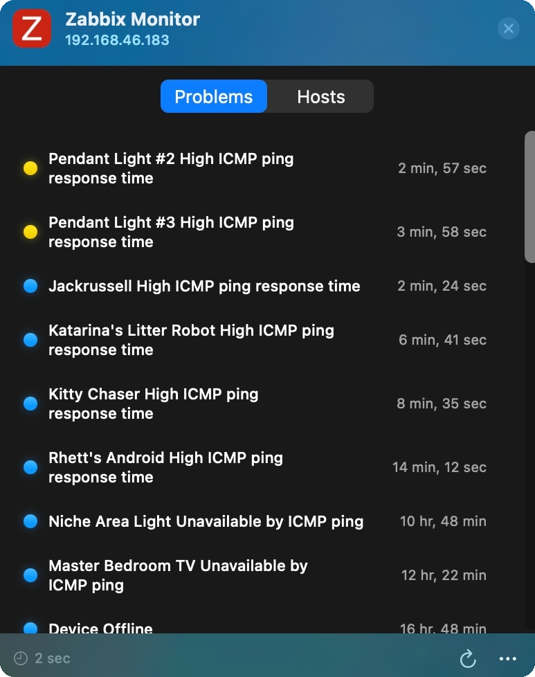
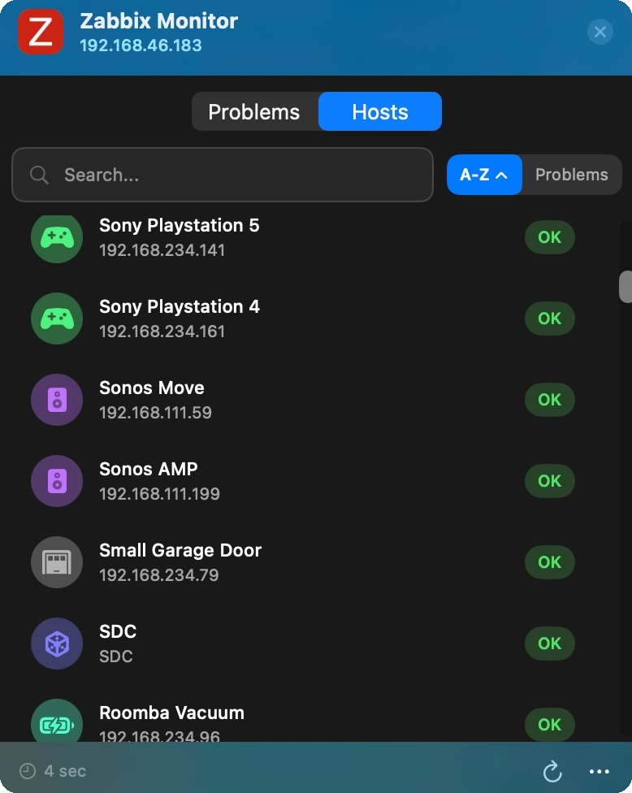
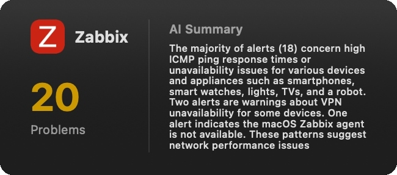
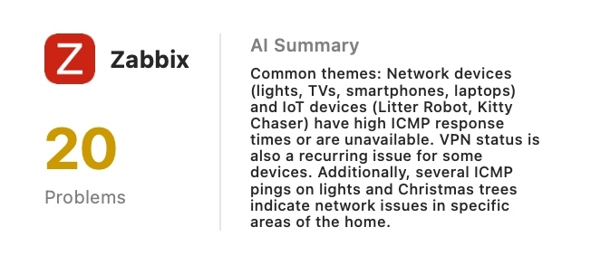
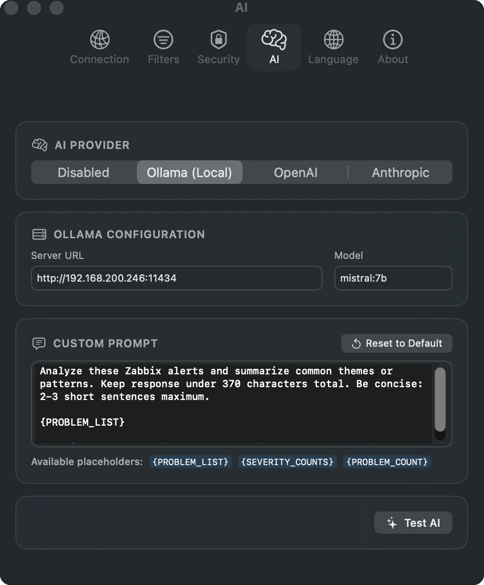
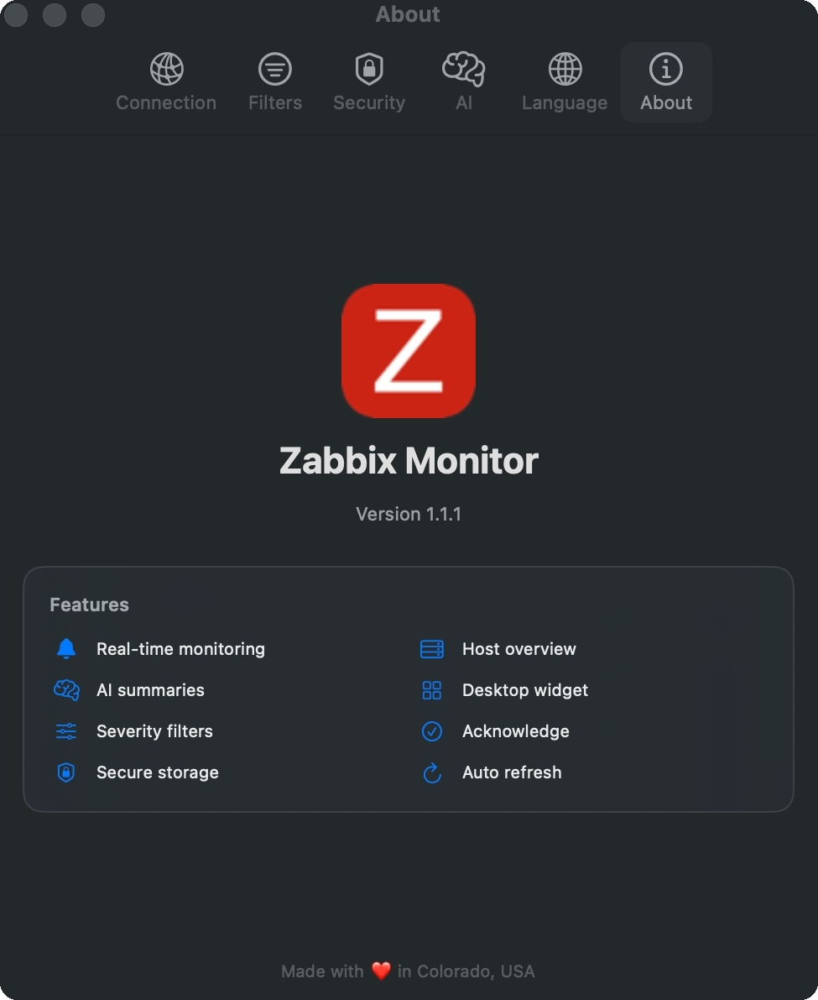
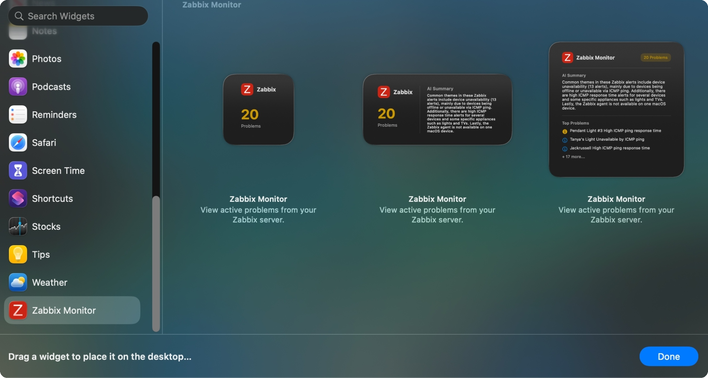

# Zabbix Monitor for macOS

**The first native macOS menu bar app for Zabbix monitoring.**

Stop switching to browser tabs to check your Zabbix alerts. Get real-time problem counts in your menu bar, AI-powered summaries in a desktop widget, and acknowledge issues without leaving your workflow.




## Why Use This?

- **Glanceable status** – Problem count + severity color always visible in menu bar
- **Desktop widget** – AI summaries of active issues (Ollama, OpenAI, or Claude)
- **Acknowledge from anywhere** – Right-click problems to ack without opening Zabbix
- **8 languages** – English, Spanish, French, German, Chinese, Japanese, Latvian, Russian

## Features

### Menu Bar App
- **Real-time Problem Count**: Displays current Zabbix problem count in the macOS menu bar
- **Severity-based Colors**: Menu bar icon color reflects highest severity (Purple=Disaster, Red=High, Orange=Average, Yellow=Warning, Blue=Info, Green=OK)
- **Problems Tab**: View all active problems with severity indicators and timestamps
- **Hosts Tab**: Browse all monitored hosts with problem count badges
- **Problem Acknowledgement**: Right-click to acknowledge problems with optional messages
- **Host Search**: Filter hosts by name with instant search

### Host Monitoring
- **Smart Host Icons**: Automatic SF Symbol icon assignment based on host naming patterns:
  - Network devices (routers, switches, firewalls)
  - Servers and VMs
  - Smart home devices (lights, thermostats, cameras)
  - Entertainment devices (TVs, speakers, gaming consoles)
  - Appliances and more
- **Custom Icons**: Right-click any host to manually override with any available SF Symbol
- **Problem Badges**: Click on problem count badges to see detailed error information
- **Flexible Sorting**: Sort hosts alphabetically or by problem severity (bidirectional)



*Right-click any host to assign a custom icon:*


### Desktop Widget
- **Multiple Sizes**: Small, Medium, and Large widget options
- **AI Summaries**: Generate concise problem summaries using your choice of AI provider
- **Problem List**: Shows top problems with severity icons when AI is disabled
- **Real-time Updates**: Syncs with menu bar app via App Groups



*Medium widget in light mode:*



### AI Integration
- **Multiple Providers**:
  - Ollama (local/self-hosted LLM)
  - OpenAI (GPT-4, GPT-3.5-turbo)
  - Anthropic (Claude models)
  - Disable AI (shows raw problems instead)
- **Configurable Models**: Choose your preferred model for each provider
- **Custom Prompts**: Customize the AI prompt with placeholders for problem data
- **Test Connection**: Verify AI provider connectivity from Settings



### Filtering & Customization
- **Severity Filtering**: Independent filters for menu bar and widget
  - Disaster, High, Average, Warning, Information, Not Classified
- **Problem Sorting**: Sort by Criticality, Latest, or Alphabetical
- **Auto-Refresh**: Configurable intervals (5 seconds to 5 minutes, or manual only)

### Security
- **Keychain Storage**: Credentials stored securely in macOS Keychain
- **Self-Signed Certificates**: Optional support for local network servers with self-signed SSL
- **Session Management**: Logout clears all saved credentials

### Localization
- **8 Languages Supported**: English, Spanish, French, German, Chinese (Simplified), Japanese, Latvian, and Russian
- **Language Selection**: Choose your preferred language in Settings
- **Full UI Translation**: All menus, settings, severity labels, and widget text are localized



## Severity Colors

The menu bar icon shows the current problem count, color-coded by severity:

🟣 Disaster (severity 5)<br>
🔴 High (severity 4)<br>
🟠 Average (severity 3)<br>
🟡 Warning (severity 2)<br>
🔵 Information (severity 1)<br>
🟢 No active problems

## Quick Start

1. Download the [latest release](https://github.com/jacks4ever/Zabbix-Monitor-for-macOS/releases)
2. Move `Zabbix Monitor.app` to `/Applications`
3. Launch and enter your Zabbix server URL (e.g., `https://zabbix.example.com/api_jsonrpc.php`)
4. Login with your Zabbix credentials
5. (Optional) Right-click desktop → Edit Widgets → Add "Zabbix Monitor"

## Requirements

- macOS Sequoia or later
- A Zabbix server with API access (Zabbix 6.4+ recommended)
- (Optional) AI provider for summaries: Ollama (local), OpenAI, or Anthropic

## Building from Source

If you prefer to build from source:

1. Clone the repository:
   ```bash
   git clone https://github.com/jacks4ever/Zabbix-Monitor-for-macOS.git
   ```

2. Open the project in Xcode:
   ```bash
   cd Zabbix-Monitor-for-macOS
   open ZabbixMenuBar.xcodeproj
   ```

3. Build and run (`Cmd+R`)

4. Configure via the menu bar app's Settings

**Requirements for building:** Xcode 15+

## Configuration

All settings are configurable through the app's Settings panel (accessible via the menu bar dropdown):

### Connection Tab
- **Zabbix Server URL**: Your Zabbix API endpoint (e.g., `https://your-zabbix-server/api_jsonrpc.php`)
- **Username**: Zabbix API username
- **Refresh Interval**: How often to fetch updates (5 seconds to 5 minutes)
- **Problem Sort Order**: Criticality, Latest, or Alphabetical

### Filters Tab
- **Menu Bar Severity**: Choose which severity levels appear in the menu bar
- **Widget Severity**: Independent severity filter for the desktop widget

### Security Tab
- **Self-Signed Certificates**: Enable for local network servers
- **Authentication Status**: View connection status and clear saved credentials

### AI Tab
- **Provider Selection**: Choose between Disabled, Ollama, OpenAI, or Anthropic
- **Provider Settings**: Configure server URLs, API keys, and model selection
- **Test AI**: Verify your AI provider connection

## Architecture

### Targets
- **ZabbixMenuBar** - Main menu bar application
- **ZabbixWidget** - WidgetKit extension for desktop widget

### Key Files
- `ZabbixMenuBar/ZabbixAPIClient.swift` - Zabbix API client, AI provider integration, Keychain storage
- `ZabbixMenuBar/ZabbixStatusView.swift` - Main UI with Problems/Hosts tabs, smart icon detection
- `ZabbixMenuBar/SettingsView.swift` - Settings UI with Connection, Filters, Security, AI, Language, and About tabs
- `ZabbixWidget/ZabbixWidget.swift` - Widget views (small, medium, large)
- `Shared/SharedData.swift` - Data sharing between app and widget via App Groups
- `Shared/AppLanguage.swift` - Language enum and manager for localization
- `Shared/Localizable.xcstrings` - String Catalog with translations (8 languages)

## Adding the Widget

1. Right-click on the desktop
2. Select "Edit Widgets..."
3. Search for "Zabbix"
4. Drag the widget to your desktop (available in Small, Medium, and Large sizes)



## Technical Notes

### Zabbix API
- Uses `trigger.get` with `value=1` filter for real-time problem state (more reliable than `problem.get`)
- Supports Zabbix 6.4+ Bearer token authentication
- Disables caching to ensure fresh data on every request

### Widget Data Sharing
- Uses App Groups with Team ID prefix format required by macOS Sequoia
- Data stored in `~/Library/Group Containers/[TeamID].com.zabbixmenubar/`

## Troubleshooting

**"Connection failed" with self-signed certificate**
→ Settings → Security → Enable "Allow Self-Signed Certificates"

**Widget not appearing in gallery**
→ Ensure app is in `/Applications`, not Downloads. Log out and back in.

**Stale data in widget**
→ Remove widget, log out/in, re-add widget (macOS caches widget UI aggressively)

**API authentication errors**
→ Ensure your Zabbix user has API access permissions. Zabbix 6.4+ uses Bearer token authentication.

## Contributing

Contributions are welcome! Please feel free to submit a Pull Request.

## Disclaimer

This project is an independent, unofficial application and is not affiliated with, endorsed by, or connected to Zabbix SIA or the Zabbix project in any way. "Zabbix" is a registered trademark of Zabbix SIA. This application is a third-party tool that interfaces with the Zabbix API for personal monitoring purposes.

## License

MIT License - see [LICENSE](LICENSE) for details.

---

Made with ❤️ in Colorado, USA
